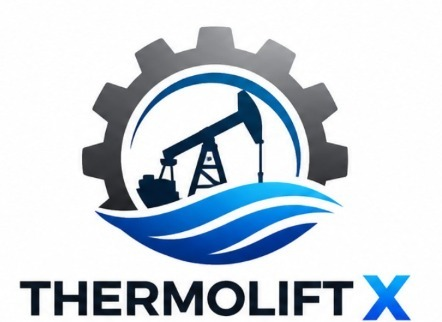

# ⚙️ THERMOLIFT X // Baghewala Heavy Oil Decision Twin

<p align="center">
  
</p>

<p align="center">
  <strong>Autonomous Closed-Loop Diagnostic & Supervisory Control Twin for Cyclic Steam Stimulation (CSS) & Sucker Rod Pump (SRP) Artificial Lift</strong><br>
  <em>Developed for Oil India Limited (Baghewala Heavy Oil Field, Jodhpur Sandstone Reservoir) // SIH 26120</em>
</p>

---

## 📌 Executive Overview

**THERMOLIFT X** is an industrial-grade, physics-coupled digital twin built specifically to solve the thermal lift paradox in heavy crude reservoirs (17.4° API, Baghewala field, Rajasthan). In low in-situ reservoir temperature (47°C) environments subjected to high-temperature (300°C) Cyclic Steam Stimulation (CSS), transient heat dissipation causes crude viscosity to rebound aggressively from ~150 cP up to 10,000+ cP over the 90-day soak/production window.

This steep viscosity gradient triggers severe operational hazards:
- **Buoyant Rod Floating & Buckling Risk**: Downward friction exceeds the buoyant rod string weight, leading to severe compressive rod buckling, fluid pound, and fatigue failures.
- **Gas Interference & Emulsion Drag**: Dynamic gas breakout and emulsion phases diminish pump volumetric fillage.
- **Uncoordinated CSS Thermal Cycles**: Inadequate steam-to-lift matching causes premature thermal cooldown and high downtime.

**THERMOLIFT X** delivers real-time closed-loop diagnostic intelligence, automated Gibbs wave equation PDE solving, 60 FPS 4-bar kinematic pump visualization, and continuous supervisory setpoint optimization to maximize daily production while eliminating downhole mechanical failures.

---

## 🚀 Key Engineering Capabilities

### 1. 15-Parameter Coupled SCADA Physics & Kinematics Matrix
Dynamic bidirectional control over the coupled thermo-mechanical lift envelope:
- **Kinematics**: Pump Speed (1.5 – 8.0 SPM), Polished Rod Stroke Length (74 – 168 in), Rod String Taper (7/8" – 3/4" Standard & Heavy Tapers), Motor Torque (% rated).
- **Thermal & CSS**: Flowline Temp (35 – 95°C), Reservoir Temp (40 – 110°C), Steam Soak Days (1 – 14 Days), Steam Quality (40 – 95%).
- **Rheology & Wellbore**: Crude Viscosity (200 – 12,000 cP), API Gravity (14.0 – 22.0° API), Water Cut (5 – 85%), GOR (30 – 600 scf/bbl), Pump Depth (600 – 1200 m True Vertical Depth), Pump Fillage (20 – 100%), Tubing Head Pressure (50 – 350 psi).

### 2. Live 60 FPS Sucker Rod Pump (SRP) Kinematic Simulator
- **Exact 4-Bar Mechanism**: Mathematically driven crank arm, rotating counterweight, pitman linkage, Samson post bearing, and contoured horsehead walking beam.
- **Continuous Surface-to-Downhole Wellbore Column**:
  - Carrier bar and bridle wire synchronously lifting the polished rod.
  - Subsurface casing and production tubing string extending 950m downhole.
  - Reciprocating plunger with Traveling Valve (TV) and barrel base Standing Valve (SV) ball states dynamically responding to hydrodynamic differential pressure.
- **Precise Stroke Synchronization**: Sage Green (`▲ UPSTROKE`) with closed TV / open SV lifting column fluid; Slate Teal (`▼ DOWNSTROKE`) with open TV / closed SV descending through formation crude.

### 3. Gibbs Wave PDE Dynacard Oscilloscope
- Solves the second-order 1D damped wave equation ($\frac{\partial^2 u}{\partial t^2} = c^2 \frac{\partial^2 u}{\partial x^2} - \alpha \frac{\partial u}{\partial t}$) governing acoustic stress propagation in the elastic rod string.
- Renders dual dynacards:
  - **Surface Dynamometer Card**: High-frequency telemetry mapped with a synchronized real-time load tracer dot, glowing halo, and decaying kinematic trail.
  - **Downhole Pump Card**: Wave equation inverted downhole condition revealing effective plunger travel, fillage delay, and fluid pound impact.

### 4. Live Pump HUD (Picture-in-Picture / PiP)
- **Zero-Obstruction Fluid Transitions**: Smoothly stays hidden at the top of the console while viewing the main pump simulator.
- **Scroll-Aware Reveal**: Smoothly glides in at the bottom-right corner when scrolling through parameters, fleet tables, or incident replay scenarios.
- **1-Click Scroll-To-Top**: Arrow `↑` smoothly returns to the full simulator.
- **Expandable Mini Twin**: Clicking `+` expands a standalone miniature animated SRP twin with synchronized stroke phase, instant travel (inches), instant load (kN), and VFD speed (SPM).

### 5. Autonomous Closed-Loop AI Rectification & Audit Log
- **1-Click AI Rectification**: Automatically calculates safe VFD frequency and thermal setpoints, eliminating rod floating risk in under 1 second.
- **Certified SCADA Audit Generation**: Generates compliant engineering reports documenting timestamped setpoint adjustments, Gibbs load variations, and operator verifications.

---

## 📂 Repository Architecture

```text
thermolift-x/
├── backend/
│   ├── main.py                  # FastAPI SCADA backend & REST API endpoints
│   ├── physics_engine.py        # Coupled reservoir heat dissipation & Gibbs PDE solver
│   └── models.py                # Data schemas & telemetry contracts
├── stitch_import/
│   ├── code.html                # Full SCADA console (Kinematics, Matrix, PiP HUD, Dynacard)
│   └── assets/
│       ├── thermolift_x_logo.png             # High-Resolution Brand Logo
│       ├── thermolift_x_logo_transparent.png # Transparent Vector-Grade PNG
│       ├── thermolift_x_logo.jpg             # Original Brand Asset
│       └── favicon.png                       # Browser Tab Emblem
├── frontend/                    # Classic SCADA modular frontend components
├── docs/                        # Engineering documentation & mathematical derivations
└── README.md                    # Project Documentation
```

---

## 🛠️ Quickstart & Local Setup

### 1. Prerequisites
- Python 3.10+
- Modern Web Browser (Chrome, Edge, Firefox, Brave)

### 2. Installation
```bash
# Clone the repository
git clone https://github.com/monesh-10/thermolift-x.git
cd thermolift-x

# Create virtual environment
python -m venv venv

# Activate virtual environment
# Windows:
venv\Scripts\activate
# Linux/macOS:
source venv/bin/activate

# Install dependencies
pip install fastapi uvicorn pydantic jinja2
```

### 3. Running the Digital Twin
```bash
# Start the FastAPI SCADA backend server
python -m uvicorn backend.main:app --host 127.0.0.1 --port 8080 --reload
```

Open your browser and navigate to:
```
http://127.0.0.1:8080/stitch
```

---

## 🏆 Hackathon Context

- **Event**: Smart India Hackathon (SIH)
- **Problem Statement**: SIH 26120 — Development of a Well-to-Surface Decision Twin for Artificial Lift in Heavy Oil Wells Subjected to Cyclic Steam Stimulation (CSS).
- **Industry Partner**: Oil India Limited (OIL), Baghewala Field, Rajasthan Basin.
